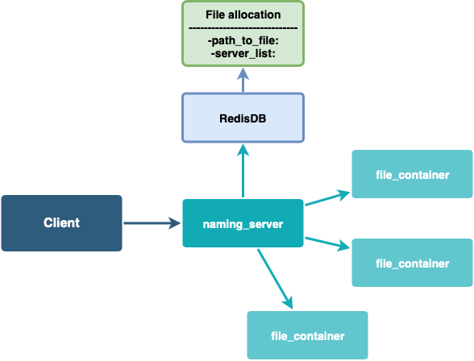

# How to launch

## Naming server
Before running you need to start redis server by the following command:
```bash
docker run -d -p 6379:6379 redis
```

After that we are ready to start out app: 
```bash
pip3 install -r requirements.txt
python3 server.py
```

Also it can be started in via docker-compose.

## Storage server
```bash
pip3 install -r requirements.txt
python3 server.py
```

Also it can be started via Dockerfile. For building it run
`docker build .`

## Client machine
```bash
pip3 install -r requirements.txt
python3 client.py
```

## Architecture


## Description of communication protocols
We use REST API and communicates via HTTP protocol

## How to use client

* Create file
```bash 
file.txt > path/to/file.txt
```

* Get file(read)
```bash 
read path/on/server/file.txt path/on/computer/file.txt
```

* Upload file(write)
```bash 
write path/on/computer/file.txt path/on/server/file.txt
```

* Delete file
```bash 
rm path/on/server/file.txt
```

* Get file info
```bash 
stat path/on/server/file.txt
```

* Copy file
```bash 
cp path/on/server/from/file.txt path/on/server/to/file.txt
```

* Move file
```bash 
mv path/on/server/from/file.txt path/on/server/to/file.txt
```

* Open directory
```bash 
cd path/to/directory
```

* Read directory
```bash 
ls
```

* Make directory
```bash 
mkdir path/to/directory
```

* Delete directory
```bash 
rmdir path/to/directory 
```